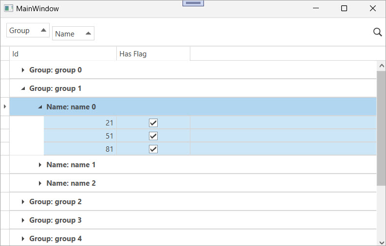

<!-- default badges list -->

[](https://supportcenter.devexpress.com/ticket/details/E4617)
[](https://docs.devexpress.com/GeneralInformation/403183)
[](#does-this-example-address-your-development-requirementsobjectives)
<!-- default badges end -->

# WPF Data Grid – Select Child Rows When a User Clicks or Expands a Group Row

This example selects all child rows in a group when a user expands a group row or clicks a group row.



Use this technique when you need to:

* Select all children after a group expands.
* Select children on a group-row click.
* Apply recursive selection in nested groups.

## Implementation Details

### Attached Behavior

Specify the `GroupChildSelector.Mode` attached property for the [`TableView`](https://docs.devexpress.com/WPF/DevExpress.Xpf.Grid.TableView) and set the property to one of the following modes:

* `None` — no selection.
* `Child` — select direct children.
* `Hierarchical` — select all descendants in expanded subgroups.

The child-row selection logic works with two events: 

* `PreviewMouseLeftButtonUp` - fires when a user clicks a group row. 
* [`GroupRowExpanding`](https://docs.devexpress.com/WPF/DevExpress.Xpf.Grid.GridControl.GroupRowExpanding) - fires when a user expands a group. 

When either event occurs, the child-row selection logic selects all child rows in that group and calls [`BeginSelection`](https://docs.devexpress.com/WPF/DevExpress.Xpf.Grid.DataControlBase.BeginSelection) and [`EndSelection`](https://docs.devexpress.com/WPF/DevExpress.Xpf.Grid.DataControlBase.EndSelection) methods to apply the changes in one step.

```xaml
<dxg:GridControl>
  <dxg:GridControl.View>
    <dxg:TableView
      local:GroupChildSelector.Mode="Hierarchical" />
  </dxg:GridControl.View>
</dxg:GridControl>
```

### Selection Logic

The `GroupChildSelector` calls the `SelectChild(grid, groupRowHandle)` method to select all child rows in a group. In `Hierarchical` mode, if a child row is an expanded group, the method calls itself to select that group’s child rows. The code calls the `BeginSelection` method before changes and the `EndSelection` method after changes to update the selection in a single step.

### Data Setup

In the `MainWindow` constructor, the `DataContext` is set to the collection returned by the `SampleDataRow.CreateRows()` method. This method creates 100 data rows with `Id`, `Group`, `Name`, and `HasFlag` fields.

## Files to Review

* [MainWindow.xaml](./CS/GridGroupSelect/MainWindow.xaml) (VB: [MainWindow.xaml](./VB/GridGroupSelect/MainWindow.xaml))
* [MainWindow.xaml.cs](./CS/GridGroupSelect/MainWindow.xaml.cs) (VB: [MainWindow.xaml.vb](./VB/GridGroupSelect/MainWindow.xaml.vb))
* [GroupChildSelector.cs](./CS/GridGroupSelect/GroupChildSelector.cs) (VB: [GroupChildSelector.vb](./VB/GridGroupSelect/GroupChildSelector.vb))
* [SampleDataRow.cs](./CS/GridGroupSelect/SampleDataRow.cs) (VB: [SampleDataRow.vb](./VB/GridGroupSelect/SampleDataRow.vb))

## Documentation

* [Data Grid](https://docs.devexpress.com/WPF/6084/controls-and-libraries/data-grid)
* [GridControl](https://docs.devexpress.com/WPF/DevExpress.Xpf.Grid.GridControl)
* [GridColumn](https://docs.devexpress.com/WPF/DevExpress.Xpf.Grid.BandBase.GridColumn)
* [TableView](https://docs.devexpress.com/WPF/DevExpress.Xpf.Grid.TableView)

## More Examples

* [WPF Data Grid - Specify Custom Content for Headers Displayed in the Column Chooser](https://github.com/DevExpress-Examples/wpf-data-grid-custom-content-for-column-chooser-headers)
* [WPF Data Grid - Bind to Dynamic Data](https://github.com/DevExpress-Examples/wpf-bind-gridcontrol-to-dynamic-data)
* [Implement CRUD Operations in the WPF Data Grid](https://github.com/DevExpress-Examples/wpf-data-grid-implement-crud-operations)
* [WPF Grid - Resize Rows Using a Splitter](https://github.com/sergepilipchuk/wpf-grid-resize-rows-using-splitter)

<!-- feedback -->
## Does this example address your development requirements/objectives?

[](https://www.devexpress.com/support/examples/survey.xml?utm_source=github&utm_campaign=how-to-select-all-group-subitems-when-a-group-row-is-clicked-wpf-e4617&~~~was_helpful=yes) [](https://www.devexpress.com/support/examples/survey.xml?utm_source=github&utm_campaign=how-to-select-all-group-subitems-when-a-group-row-is-clicked-wpf-e4617&~~~was_helpful=no)

(you will be redirected to DevExpress.com to submit your response)
<!-- feedback end -->
